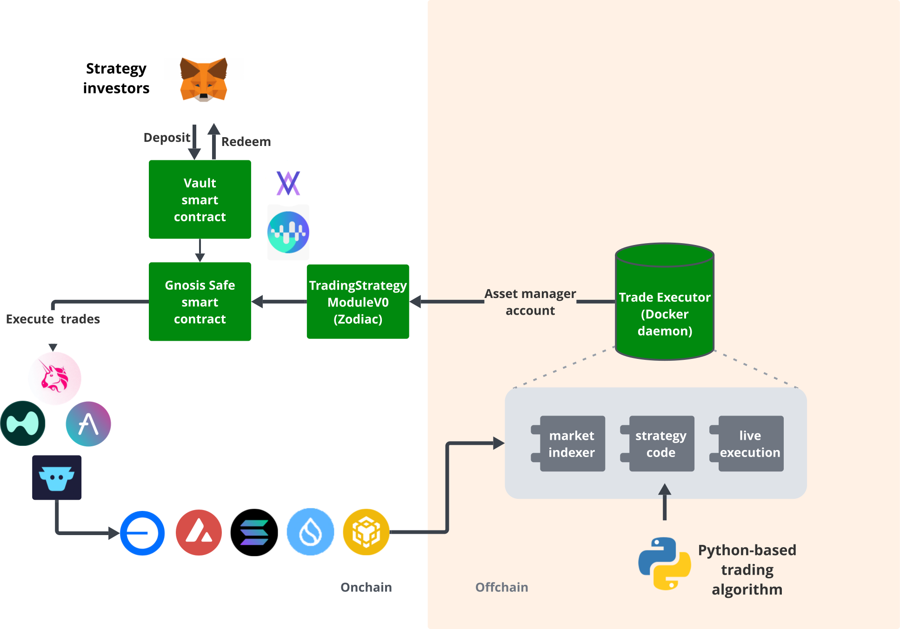

# Trading Strategy Zodiac-module for Safe multisignature wallets

[TradingStrategyModuleV0](./src/TradingStrategyModuleV0.sol) is a Zodiac-module for Gnosis Safe multisignature wallets.
It enables automated trading, or "trading algorithms" or "AI-agent", for various use cases,
where the algorithm has limited access rights to open and close trades with the capital secured in Gnosis Safe wallet.



The module enables making offchain trading decision by an asset manager, either automated (algorithm) or manual (discretional trading), and then verifying that these trades are within the given security rules. 
The security rules are in onchain `TradingStrategyModuleV0` smart contract. When an asset manager initiates a trade,
the trade is first verified by the module, and if it passes the verification, it is executed by the Safe wallet. 
Even if the asset manager is compromised, they cannot withdraw the capital or do harm to the liquidity providers of the vault. 

- The main use case is enable safe algorithmic trading ("AI agents" or "trading bots") for vaults and private capital in Gnosis Safe wallets.
  The algorithm is hosted on [offchain oracles](https://github.com/tradingstrategy-ai/trade-executor/) called Trade Executors,
  which run the algorith logic in [Python](https://tradingstrategy.ai/glossary/python), and then submit the trades
  to the Safe wallet via this module using a special asset manager role.
- This is a [Zodiac framework-based](https://github.com/gnosisguild/zodiac) smart contract 
- The module is designed to be used with [Lagoon vaults](https://tradingstrategy.ai/glossary/lagoon),
  but it works with any Safe smart contract wallet or product
- This module is a guard-design pattern based smart contract, which has complex dynamic 
  logic to whitelist allowed trades (DEXes, trading pairs, lending protocols, assets and so on)
  limiting or eliminating the scope of the damage of what a compromised asset manager could do
- The module has Python-bindings (see [eth-defi package](https://github.com/tradingstrategy-ai/web3-ethereum-defi) and high level interface to construct trades offchain, 
  with a lot of developer experience and diagnostics tools, making it easy to use for offchain trading algorithms  
- For more information see [Trading Strategy website](https://tradingstrategy.ai)

**Note**: This code is not audited. The Zodiac-module smart contract is called [TradingStrategyModuleV0](./src/TradingStrategyModuleV0.sol) reflecting the Minimum Viable product nature of this work.

## Dependencies

Included as Github submodules

- Zodiac: main: https://github.com/gnosisguild/zodiac/tree/master/contractscd ..
- Safe> v1.3.0-1: https://github.com/safe-global/safe-smart-account/
- OpenZeppelin: release-v3.4: https://github.com/OpenZeppelin/openzeppelin-contracts

## Rules and whitelists

- See [GuardBaseV0](../guard/src/GuardV0Base.sol) for the rule logic and supported protocols. 
- The protocols include, but are not limited to: Uniswap, Aave, ERC-4626, ERC-7540, Gains-like, 1delta. 

## How to use

- The code is designed to be used with offchain Python automation
- [See Lagoon integration code in eth-defi Python package](https://web3-ethereum-defi.readthedocs.io/api/lagoon/index.html)

## How repackage with Python package

In `eth-defi` root, run:

```shell
make guard safe-integration
```

This will regenerate ABI files to allow Python-based automation whitelist. 

## How to test deployment

```shell
# Runs all pytest-modules tagged for guard
pytest -k guard
```
